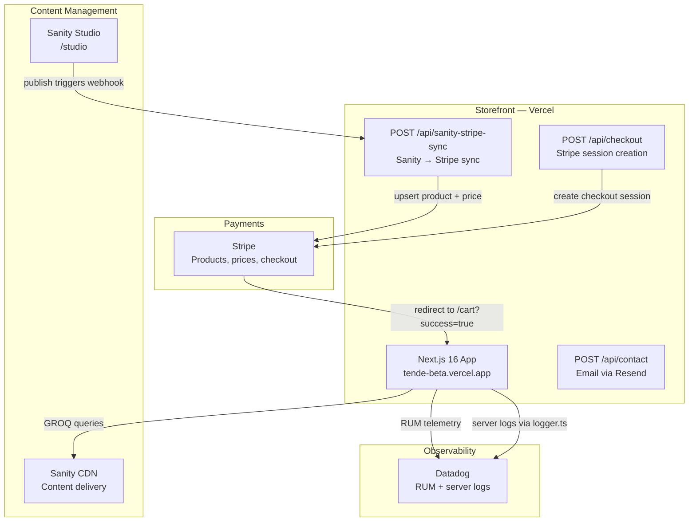
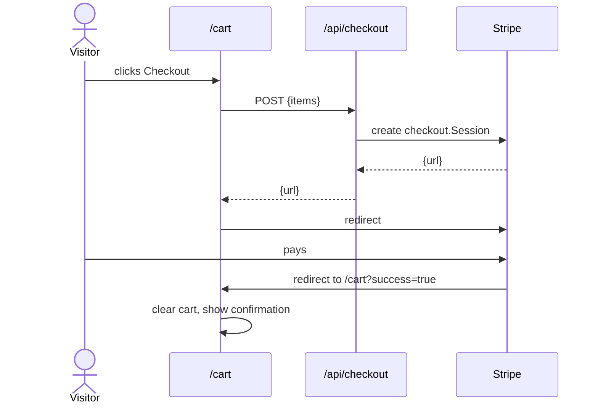
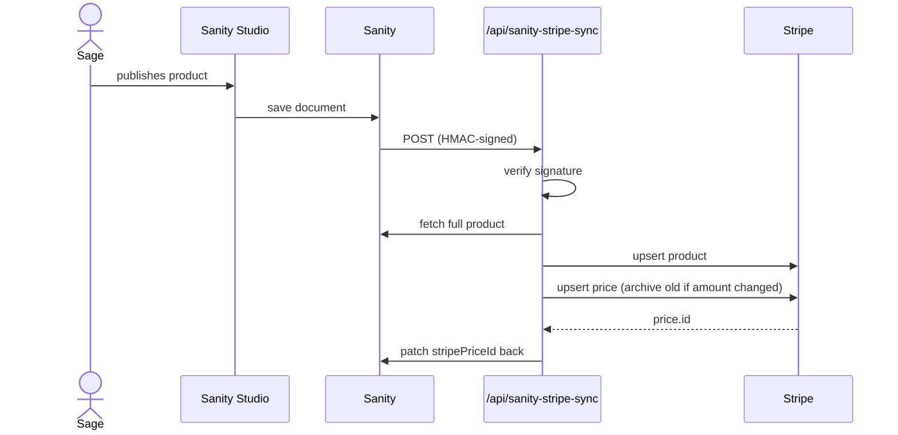

# Tende

Custom storefront for [tende.care](https://tende.care) — a plant-based hair and body care brand. Built to replace Squarespace with tighter Stripe integration and a CMS Sage can manage without code.

## Architecture



### Checkout flow



### Content sync (when Sage publishes a product)



## Services

| Service | Role |
|---------|------|
| **Next.js 16** (App Router) | Full-stack framework. Server components fetch from Sanity at build/request time. Client components handle cart state and checkout. |
| **Sanity v3** | CMS. Sage manages all content here: products, fragrance variants, events, markets, site settings (bio, FAQs, testimonials). |
| **Stripe** | Payments. Each Sanity product maps to a Stripe product + price. Checkout sessions are created server-side; Stripe handles PCI compliance. |
| **Vercel** | Hosting + edge delivery. ISR revalidation keeps pages fresh without full rebuilds. |
| **Datadog** | Observability. Browser RUM (`@datadog/browser-rum`) tracks real-user performance. Server logs from checkout and webhook routes go to Datadog HTTP intake via `lib/logger.ts`. |
| **Resend** | Transactional email for the contact form (`/api/contact`). |
| **Zustand** | Client-side cart state, persisted to `localStorage`. |

## Sanity schemas

| Schema | Purpose |
|--------|---------|
| `product` | Core product: title, images, category, price (in **dollars**), fragrance variants, stock status. |
| `fragrance` | Reusable scent definition. Referenced by product variants. Name format: `"Scent Name \| Notes"`. |
| `event` | A pop-up or market appearance. Can reference a saved `market` for name/location, or be one-off. |
| `market` | Saved recurring market venue (name, default location, website). Reuse across many events. |
| `siteSettings` | Singleton document. Drives the About page (founder photo + bio), FAQ page, and homepage testimonials. |

## Prices

Prices are stored in **dollars** in Sanity (e.g. `32` for $32.00). The Stripe sync and bulk-create script multiply by 100 before sending to Stripe, since Stripe uses integer cents.

## Routes

| Route | Type | Notes |
|-------|------|-------|
| `/` | Server component | Homepage with featured products + testimonials from Sanity |
| `/shop` | Server component | All products, filterable by category |
| `/shop/[slug]` | Server component | Product detail with fragrance picker |
| `/cart` | Client component | Cart and Stripe checkout trigger |
| `/events` | Server component | Upcoming events from Sanity, revalidated hourly |
| `/about` | Server component | Founder photo + bio from Sanity siteSettings |
| `/faq` | Server component | FAQ from Sanity siteSettings |
| `/contact` | Client component | Contact form → Resend |
| `/studio` | Sanity Studio | Embedded CMS UI (next-sanity) |
| `/for-sage` | Server component | Hidden guide for Sage; `noindex` |
| `/api/checkout` | Route handler | Creates Stripe checkout session |
| `/api/sanity-stripe-sync` | Route handler | Receives Sanity webhook; syncs product/price to Stripe |
| `/api/contact` | Route handler | Sends contact form email via Resend |

## Development setup

```bash
# Install dependencies
npm install

# Copy and fill in env vars
cp .env.example .env.local

# Start dev server
npm run dev
```

Open [http://localhost:3000](http://localhost:3000). Studio is at [http://localhost:3000/studio](http://localhost:3000/studio).

## Environment variables

| Variable | Description |
|----------|-------------|
| `STRIPE_SECRET_KEY` | Stripe secret key (`sk_test_…` in dev, `sk_live_…` in prod) |
| `STRIPE_WEBHOOK_SECRET` | Stripe webhook signing secret |
| `NEXT_PUBLIC_STRIPE_PUBLISHABLE_KEY` | Stripe publishable key (client-safe) |
| `SANITY_API_TOKEN` | Sanity API token with write access (for webhook patching stripePriceId back) |
| `SANITY_WEBHOOK_SECRET` | HMAC secret for verifying Sanity webhook signatures |
| `NEXT_PUBLIC_SANITY_PROJECT_ID` | Sanity project ID |
| `NEXT_PUBLIC_SANITY_DATASET` | Sanity dataset (default: `production`) |
| `NEXT_PUBLIC_SITE_URL` | Full base URL (e.g. `https://tende-beta.vercel.app`) |
| `RESEND_API_KEY` | Resend API key for contact form emails |
| `DD_API_KEY` | Datadog API key for server log ingestion |
| `NEXT_PUBLIC_DD_APPLICATION_ID` | Datadog RUM application ID |
| `NEXT_PUBLIC_DD_CLIENT_TOKEN` | Datadog RUM client token |

## Scripts

```bash
# Bulk-create Stripe products + prices from Sanity (idempotent, safe to re-run)
node scripts/create-stripe-products.mjs

# One-time: migrate Sanity prices from cents → dollars (run after schema change)
node scripts/migrate-prices-to-dollars.mjs
```

## Launch checklist

Before cutting DNS from Squarespace to this app:

- [ ] Switch to live Stripe keys (`sk_live_…`) in Vercel env vars
- [ ] Run `create-stripe-products.mjs` with live keys
- [ ] Upload all product images to Sanity (remove Squarespace CDN dependencies)
- [ ] Upload founder photo to Sanity siteSettings
- [ ] Confirm `migrate-prices-to-dollars.mjs` has been run
- [ ] Update Sanity webhook URL to production domain
- [ ] Update `NEXT_PUBLIC_SITE_URL` on Vercel to production domain
- [ ] Configure custom domain on Vercel
- [ ] Test end-to-end checkout with live keys
